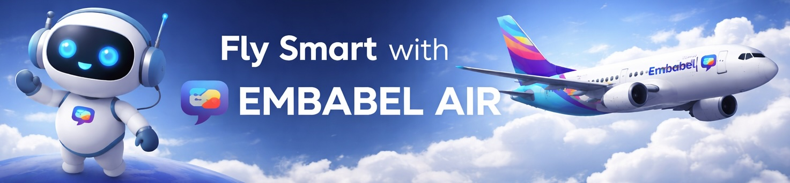
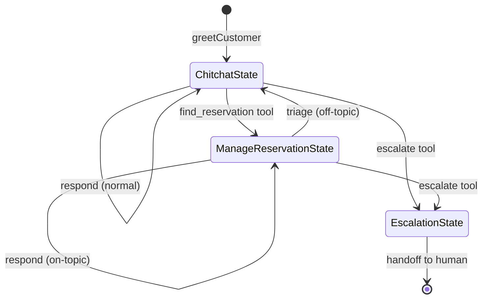

&nbsp;&nbsp;&nbsp;&nbsp;

&nbsp;&nbsp;&nbsp;&nbsp;

# Embabel Air

AI-powered airline assistant with chat interface built on [Embabel Agent](https://github.com/embabel/embabel-agent).

## Layering GenAI on Existing Spring Applications

This application demonstrates how to add generative AI capabilities to an **existing Spring/Spring Data/JPA backend** using the Embabel Agent framework. Rather than rewriting your application, you layer AI on top:

- **Existing domain model** - JPA entities (`Customer`, `Reservation`, `Flight`) remain unchanged
- **Existing persistence** - Spring Data repositories continue to manage data access
- **Existing business logic** - Services and transactions work as before
- **AI layer added on top** - Entity Views expose your domain to LLMs with safe, transactional access

This approach aligns with the [DICE](https://medium.com/@springrod/context-engineering-needs-domain-understanding-b4387e8e4bf8) philosophy: AI agents need deep domain understanding to be effective. By connecting AI to your real domain model rather than building a separate abstraction, the LLM gains access to the same rich semantics your application already has.

```
┌─────────────────────────────────────────────────────────────┐
│                    AI Layer (New)                           │
│  ┌─────────────┐  ┌─────────────┐  ┌─────────────────────┐  │
│  │ ChatActions │  │ EntityViews │  │ RAG (PgVectorStore) │  │
│  │ (States)    │  │ (Tools)     │  │ (Policy Search)     │  │
│  └─────────────┘  └─────────────┘  └─────────────────────┘  │
├─────────────────────────────────────────────────────────────┤
│                 Existing Spring Backend                     │
│  ┌─────────────┐  ┌─────────────┐  ┌─────────────────────┐  │
│  │ JPA Entities│  │ Spring Data │  │ Business Services   │  │
│  │ (Domain)    │  │ Repositories│  │ (Transactions)      │  │
│  └─────────────┘  └─────────────┘  └─────────────────────┘  │
├─────────────────────────────────────────────────────────────┤
│                    PostgreSQL + pgvector                    │
└─────────────────────────────────────────────────────────────┘
```

## Prerequisites

- Java 21
- Docker (for PostgreSQL)
- Maven

## Database Setup

The application uses PostgreSQL with pgvector for persistence.

### Start PostgreSQL

```bash
docker compose up -d
```

This starts a PostgreSQL 17 container with pgvector extension on port 5432.

### Reset Database

To completely reset the database (wipe all data and re-run migrations):

```bash
docker compose down -v && docker compose up -d
```

The `-v` flag removes the Docker volume, deleting all data. On next startup, Flyway will re-run all migrations and the
dev data seeder will recreate demo users and flights.

### Database Configuration

Default connection settings in `application.yml`:

```yaml
spring:
  datasource:
    url: jdbc:postgresql://localhost:5432/embabel_air
    username: embabel
    password: embabel
```

## Database Migrations

Flyway manages database schema migrations automatically on startup.

Migrations are in `src/main/resources/db/migration/` with naming convention `V{version}__{description}.sql`.

### Generate DDL

To regenerate DDL from JPA entities:

```bash
mvn test -Dtest=GenerateDdlTest
```

This outputs to `src/main/resources/db/schema.sql`. Copy relevant changes to a new migration file.

## Running the Application

### Quick Start

1. Start the database:
   ```bash
   docker compose up -d
   ```

2. Run the application:
   ```bash
   mvn spring-boot:run
   ```

3. Open http://localhost:8747 in your browser

### Default Port

The application runs on port **8747** by default (configured in `application.yml`).

### Demo Users

The dev data seeder creates demo users with different loyalty tiers:

| Username | Status | Description |
|----------|--------|-------------|
| alex.novice | New | New customer, no flights yet |
| sam.bronze | Bronze | Some travel history |
| jamie.silver | Silver | Regular traveler |
| taylor.gold | Gold | Frequent flyer |
| morgan.platinum | Platinum | Elite traveler |

All demo users use password: `password`

## Running Tests

```bash
mvn test
```

Integration tests use Testcontainers to spin up a PostgreSQL instance automatically.

## Entity Views: Solving the Disconnected Data Problem

When building AI agents that interact with JPA entities, you face a fundamental challenge: **LLM calls are slow** (seconds), but **JPA transactions should be fast** (milliseconds). You can't hold a database transaction open while waiting for an LLM response.

### The Problem

```
┌──────────────────────────────────────────────────────────────────┐
│                    Traditional Approach (Broken)                  │
├──────────────────────────────────────────────────────────────────┤
│  1. Begin transaction                                            │
│  2. Load Customer entity                                         │
│  3. Call LLM with customer data...                               │
│     ┌─────────────────────────────┐                              │
│     │  🕐 2-5 seconds waiting     │  ← Transaction held open!    │
│     │     for LLM response        │  ← Lazy collections fail     │
│     └─────────────────────────────┘  ← Connection pool exhausted │
│  4. LLM calls tool: customer.getReservations()                   │
│     💥 LazyInitializationException - session closed!             │
└──────────────────────────────────────────────────────────────────┘
```

### The Solution: Entity Views

Entity Views provide a clean separation between your domain model and AI access:

```java
@LlmView
public interface CustomerView extends EntityView<Customer> {

    @LlmTool(description = "Get customer's flight reservations")
    default List<ReservationView> getReservations() {
        return getEntity().getReservations().stream()
            .map(r -> entityViewService.viewOf(r))
            .toList();
    }
}
```

**How it works:**

1. **Views are interfaces** - They wrap entities without modifying them
2. **Each tool call opens a fresh transaction** - The framework reloads the entity
3. **Lazy loading works** - Collections are accessed within the transaction
4. **No long-held connections** - Transactions are milliseconds, not seconds

```
┌──────────────────────────────────────────────────────────────────┐
│                    Entity View Approach (Works)                   │
├──────────────────────────────────────────────────────────────────┤
│  1. Create CustomerView (no transaction yet)                     │
│  2. Add view to LLM context (just metadata)                      │
│  3. Call LLM...                                                  │
│     ┌─────────────────────────────┐                              │
│     │  🕐 2-5 seconds waiting     │  ← No transaction held!      │
│     └─────────────────────────────┘                              │
│  4. LLM calls tool: getReservations()                            │
│     ┌─────────────────────────────┐                              │
│     │  Begin transaction          │                              │
│     │  Reload Customer by ID      │  ← Fresh session             │
│     │  Access lazy collections    │  ← Works!                    │
│     │  Commit transaction         │  ← Fast, ~10ms               │
│     └─────────────────────────────┘                              │
│  5. Return results to LLM                                        │
└──────────────────────────────────────────────────────────────────┘
```

### Key Benefits

| Aspect | Without Entity Views | With Entity Views |
|--------|---------------------|-------------------|
| Transaction duration | Seconds (LLM wait) | Milliseconds |
| Lazy loading | Fails | Works |
| Connection pool | Exhausted | Healthy |
| Domain model | Modified for AI | Unchanged |
| Tool safety | Manual | Automatic |

### Usage in This Application

```java
// In ChatActions.respond()
var assistantMessage = context.ai()
    .withReference(entityViewService.viewOf(customer))  // Customer context + tools
    .withTool(Tool.replanAndAdd(
        entityViewService.finderFor(Reservation.class), // Finder tool
        ManageReservationState::new                     // State with ReservationView
    ))
    .respondWithSystemPrompt(conversation, ...);
```

The `EntityViewService`:
- **Auto-discovers** `@LlmView` interfaces at startup
- **Creates dynamic proxies** that reload entities per tool call
- **Generates finder tools** (`find_reservation`) that return views
- **Handles transactions** transparently

See [`src/main/java/com/embabel/springdata/README.md`](src/main/java/com/embabel/springdata/README.md) for the complete Entity View documentation.

## Agent State Machine

The chat agent uses a state machine pattern built on the Embabel Agent framework. States control the conversation flow and determine which tools and prompts are available.

### States

| State | Description |
|-------|-------------|
| `ChitchatState` | Default state for general conversation. Can search policies and find reservations. |
| `ManageReservationState` | Focused state for managing a specific reservation. Has access to reservation-specific tools. |
| `EscalationState` | Terminal state when the customer requests human assistance. |

### State Diagram



### Tool-Triggered Transitions

State transitions can be triggered by LLM tool calls using `Tool.replanAndAdd`. This pattern allows the LLM to dynamically navigate the state machine based on user intent.

```java
// When the LLM calls find_reservation, transition to ManageReservationState
Tool.replanAndAdd(
    entityViewService.finderFor(Reservation.class),
    ManageReservationState::new  // Creates state with the found reservation
)
```

**How it works:**

1. The LLM is given a tool (e.g., `find_reservation`, `escalate`)
2. When the LLM calls the tool, `Tool.replanAndAdd` wraps the result
3. The wrapper creates a new state object from the tool's artifact
4. The framework interrupts the current action and replans with the new state
5. The new state's actions become available

**Important:** The tool must return `Tool.Result.withArtifact(content, artifact)` for the transition to trigger. Plain `Tool.Result.text()` has no artifact and won't trigger replanning.

### SubState Triage Pattern

Specialized states like `ManageReservationState` implement `SubState`, which includes automatic triage to detect when the user goes off-topic:

```java
interface SubState extends AirState {
    String purpose();  // Describes what this state handles

    @Action(pre = "shouldRespond", canRerun = true)
    default AirState triage(Conversation conversation, ...) {
        // Ask LLM: "Are we still on topic with purpose X?"
        var onTopic = context.ai()
            .creating(OnTopic.class)
            .fromMessages(...);

        if (onTopic.isOnTopic()) {
            return respond(...);  // Delegate to state-specific response
        }
        return new ChitchatState();  // Route back to general chat
    }
}
```

This ensures users can naturally switch topics without getting stuck in a specialized flow.

### Condition-Based Actions

Actions use the `@Condition` annotation to determine when they can fire:

```java
@Condition
static boolean shouldRespond(Conversation conversation) {
    return conversation.lastMessageIfBeFromUser() != null;
}

@Action(pre = "shouldRespond", canRerun = true)
AirState respond(...) { ... }
```

The `shouldRespond` condition checks if the last message is from the user (meaning we need to respond). This allows actions to fire based on conversation state rather than just trigger events.
